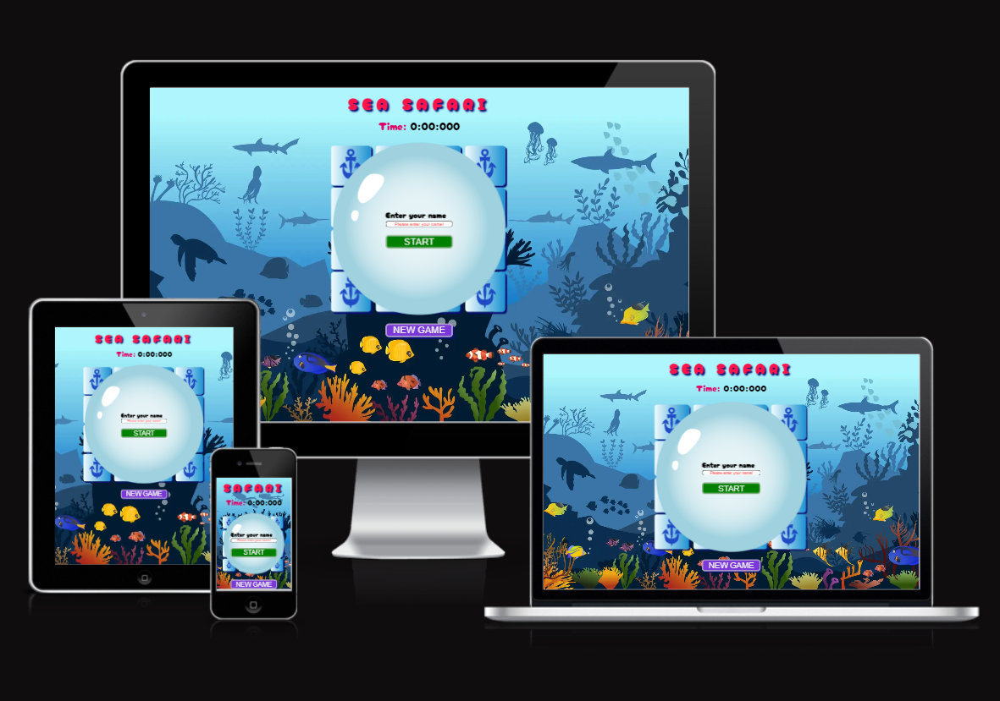

# Memory Game "Sea Safari"

[You can view the website here](https://codewizard-1.github.io/memory-game-sea-safari/)

## Project Goals

The goal of the Memory game project is to develop and improve memory, concentration, visual perception and the ability to detect matches between images or cards.
Depending on the goals and audience, the Memory game project can be adapted for education, development of mental skills, or just for fun.

## Idea
While planning this project, the idea arose to create a game in a nautical style. The marine theme allows you to create a variety of cards with different images of sea creatures (fish, starfish, crabs, etc.) and attributes (ships, anchors, steering wheels, etc.), which adds variety and interest to the game.

## Design
Various elements and resources were used in the game design to create the appropriate atmosphere and visual perception: images of marine life (dolphins, whales, fish, crabs), elements of marine nature,
attributes of navigation (anchors), color palette (blue and blue shades, as these are the colors of water).

