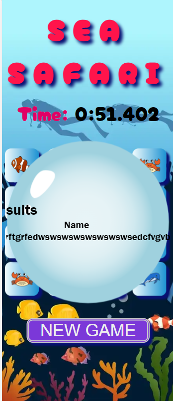

# Memory Game "Sea Safari"

[You can view the website here](https://codewizard-1.github.io/memory-game-sea-safari/)

## Project Goals

The goal of the Memory game project is to develop and improve memory, concentration, visual perception and the ability to detect matches between images or cards.
Depending on the goals and audience, the Memory game project can be adapted for education, development of mental skills, or just for fun.

## Idea
While planning this project, the idea arose to create a game in a nautical style. The marine theme allows you to create a variety of cards with different images of sea creatures (fish, starfish, crabs, etc.) and attributes (ships, anchors, steering wheels, etc.), which adds variety and interest to the game.

## Design
Various elements and resources were used in the game design to create the appropriate atmosphere and visual perception: images of marine life (dolphins, whales, fish, crabs), elements of marine nature,
attributes of navigation (anchors), color palette (blue and blue shades, as these are the colors of water).

## Wireframes

When planning the project, I used Balsamiq to create wireframes.

For desktop devices:

Start page

Game page

Results page

For mobail devices:

Start page

Game page

Results page

## Features

The site consists of three pages: the start page, the game page and the game results page.
The website has a responsive layout that automatically adjusts as the screen size changes.

**Text**: Fonts are chosen to make the text clear and beautiful.

**Images**: I use high-quality images of sea animals for cards and the landscape of the seabedю

**Buttons**:  The game has two buttons: "START" and "NEW GAME". They differ in color so that the player can easily navigate the game.
\

When you hover your cursor over these buttons, they change color, which makes the game more exciting.

**Mobile-Friendly**: The design looks great on different devices, from computers to phones.

**Convenience**: The design is made so that users can easily concentrate on the game.

**Start page**: 
On the start page the player must enter his name. This is mandatory since the player’s name will be saved so that at the end of the game the player’s name, the time for which he opened all the cards, as well as his rating will be displayed in the results table.
If the player does not enter a name, the "Start" button will not be active.

**Game page**: 
After entering the player's name and pressing the "Start" button, the start window disappears and a field with 16 cards remains.

When a player opens cards, the game compares them with each other and if the cards are the same, then they remain open, if the cards are different, then they are turned over with their backs facing the player.

As soon as the player turns over the first card, a timer starts indicating the time.
As soon as the player finds all pairs of cards, the timer will stop. This time is needed for the results table.

**Results page**: 
This page shows the top 5 player scores. The table shows the player's rating, his name and the time in which he finished the game.

The less time the player spent completing the game, the higher his rating and the player moves to a higher place in the results table.

### Languages Used

- HTML5
- CSS3
- JavaScript

## Availability

- In the process of writing code, I focused on making the game as convenient and colorful as possible.

- I added descriptive Alt attributes to images and links. This allows screen readers to explain the purpose and context of content to users with visual impairments.

- I have integrated a hover effect on all buttons so that users can easily identify when they are interacting with a button, thereby improving the overall user experience.

## Testing

| What was done | Working correctly? |
|---------------------|---------------------|
| Checking the HTML code on Validator HTML successful      | YES        |
| Checking the CSS code on Validator CSS successful      | YES        |
| Checking the JavaScript code on Validator JavaScript  successful      | YES        |
| I click on the "Start" and "New Game" buttons      | YES        |
| If the player has not entered a name, the "Start" button is not active       | YES       |
| I clicked on all the cards one by one to make sure they opened       | YES       |
| I also checked that the "Start" and "New Game" buttons change color and are visually different after being pressed|  YES       |
| Checked whether the player's name, time and rating are displayed in the results table       | YES       |
|I checked whether the player's rating changes depending on the time spent by the player on the game| YES|

